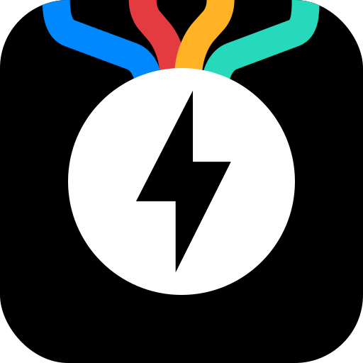

<!-- Improved compatibility of back to top link: See: https://github.com/othneildrew/Best-README-Template/pull/73 -->
<a id="readme-top"></a>

<!-- PROJECT LOGO -->
<br />
<div align="center">
  <a href="https://github.com/nomomon/fast-api-ai-sdk">
    
  </a>

<h3 align="center">Fast API & AI SDK Template</h3>

  <p align="center">
    A <i>(wannabe)</i> production-ready solution for building LLM chat applications with Next.js (Frontend) and FastAPI (Backend), powered by the Vercel AI SDK.
    <br />
    <a href="#getting-started"><strong>Get Started »</strong></a>
    <br />
    <br />
    <!-- <a href="#usage">View Demo</a>
    &middot;
    <a href="issues">Report Bug</a>
    &middot;
    <a href="issues">Request Feature</a> -->
  </p>
</div>


<!-- TABLE OF CONTENTS -->
<details>
  <summary>Table of Contents</summary>
  <ol>
    <li>
      <a href="#about-the-project">About The Project</a>
    </li>
    <li>
      <a href="#getting-started">Getting Started</a>
      <ul>
        <li><a href="#prerequisites">Prerequisites</a></li>
        <li><a href="#installation">Installation</a></li>
      </ul>
    </li>
    <li><a href="#contributing">Contributing</a></li>
    <li><a href="#license">License</a></li>
    <li><a href="#contact">Contact</a></li>
  </ol>
</details>


<!-- ABOUT THE PROJECT -->
## About The Project

Building LLM chat wrappers is becoming a common task, but setting up a robust, ~~scalable~~ architecture can be repetitive and tricky. While Next.js is fantastic for frontend development and interacting with AI SDKs, using Node.js for the backend isn't always the preferred choice for Python-native developers or teams leveraging Python's rich data science ecosystem.

This template bridges that gap. It combines the power of **Next.js** for a responsive, modern frontend with **FastAPI** for a high-performance Python backend. It handles the complexity of integrating the **Vercel AI SDK** with a custom Python backend, ensuring seamless streaming and state management without the mental overhead of switching contexts or dealing with cluttered "full-stack" Node.js monorepos.

**Key Features:**
*   **Monorepo Structure:** Clean frontend/backend separation with Makefile for script orchestration.
*   **Frontend:** Next.js 14+ (App Router), Tailwind CSS, Radix UI.
*   **Backend:** FastAPI, Pydantic, Python 3.11+.
*   **AI Integration:** Custom streaming implementation using Vercel AI SDK protocols.
*   **Developer Experience:** Type safety, linting (Biome/Ruff), and hot reloading for both services.

<p align="right">(<a href="#readme-top">back to top</a>)</p>


<!-- GETTING STARTED -->
## Getting Started

To get a local copy up and running, follow these simple steps.

### Prerequisites

Ensure you have the following installed on your system:
*   [Node.js](https://nodejs.org/) (v18 or higher)
*   [Python](https://www.python.org/) (v3.11 or higher)
*   [PNPM](https://pnpm.io/) (`npm install -g pnpm`)

### Installation

1.  **Clone the repository**
    ```sh
    git clone https://github.com/nomomon/fast-api-ai-sdk.git
    cd fast-api-ai-sdk
    ```

2.  **Install dependencies**
    Install frontend dependencies and setup backend virtual environment:
    ```sh
    make setup
    ```

3.  **Environment Setup**
    
    Copy the `.env.example` file to `.env` in the root directory and fill in your actual values:
    ```sh
    cp .env.example .env
    ```
    
    Then edit `.env` and update the following required variables:
    - `OPENAI_API_KEY` - Your OpenAI API key (required)
    - `NEXTAUTH_SECRET` - Signs NextAuth session cookies (generate with: `openssl rand -base64 32`)
    - `SECRET_KEY` - Signs backend JWT tokens for API authentication (generate with: `openssl rand -base64 32`)
    
    Optional variables (have sensible defaults):
    - `GEMINI_API_KEY` - Your Google Gemini API key
    - `DATABASE_URL` - PostgreSQL connection string
    - `CORS_ORIGINS` - Comma-separated list of allowed origins
    - `BASE_BACKEND_URL` - Your backend URL (used by Next.js API proxy, defaults to `http://localhost:8000`)
    - `NEXTAUTH_URL` - Your frontend URL (defaults to `http://localhost:3000`)
    - `NEXT_PUBLIC_BASE_URL` - Public base URL for SEO metadata
    
    **Note:** The root `.env` file is automatically used by both the backend and frontend via `env-cmd` (frontend uses `env-cmd -f ../.env next dev`). You don't need separate `.env` files in each directory. The frontend uses a Next.js API proxy route (`/api/[...path]`) that automatically forwards requests to the backend with authentication, so client-side code uses relative paths like `/api/chat` instead of direct backend URLs.

4.  **Run the application**
    Start both the frontend and backend development servers:
    ```sh
    make dev
    ```
    *   Frontend: [http://localhost:3000](http://localhost:3000)
    *   Backend API Docs: [http://localhost:8000/docs](http://localhost:8000/docs)

<p align="right">(<a href="#readme-top">back to top</a>)</p>


<!-- CONTRIBUTING -->
## Contributing

Contributions are what make the open source community such an amazing place to learn, inspire, and create. Any contributions you make are **greatly appreciated**.

If you have a suggestion that would make this better, please fork the repo and create a pull request. You can also simply open an issue with the tag "enhancement".
Don't forget to give the project a star! Thanks again!

1. Fork the Project
2. Create your Feature Branch (`git checkout -b feature/AmazingFeature`)
3. Commit your Changes (`git commit -m 'Add some AmazingFeature'`)
4. Push to the Branch (`git push origin feature/AmazingFeature`)
5. Open a Pull Request

<p align="right">(<a href="#readme-top">back to top</a>)</p>


<!-- LICENSE -->
## License

Distributed under the MIT License. See `LICENSE` for more information.

<p align="right">(<a href="#readme-top">back to top</a>)</p>


<!-- CONTACT -->
## Contact

Mansur Nurmukhambetov - [@nomomon](https://github.com/nomomon)

Project Link: [https://github.com/nomomon/fast-api-ai-sdk](https://github.com/nomomon/fast-api-ai-sdk)

<p align="right">(<a href="#readme-top">back to top</a>)</p>


<!-- MARKDOWN LINKS & IMAGES -->
<!-- https://www.markdownguide.org/basic-syntax/#reference-style-links -->
[Next.js]: https://img.shields.io/badge/next.js-000000?style=for-the-badge&logo=nextdotjs&logoColor=white
[Next-url]: https://nextjs.org/
[FastAPI]: https://img.shields.io/badge/FastAPI-005571?style=for-the-badge&logo=fastapi
[FastAPI-url]: https://fastapi.tiangolo.com/
[Python]: https://img.shields.io/badge/Python-3776AB?style=for-the-badge&logo=python&logoColor=white
[Python-url]: https://www.python.org/
[TypeScript]: https://img.shields.io/badge/TypeScript-007ACC?style=for-the-badge&logo=typescript&logoColor=white
[TypeScript-url]: https://www.typescriptlang.org/
[TailwindCSS]: https://img.shields.io/badge/Tailwind_CSS-38B2AC?style=for-the-badge&logo=tailwind-css&logoColor=white
[TailwindCSS-url]: https://tailwindcss.com/
